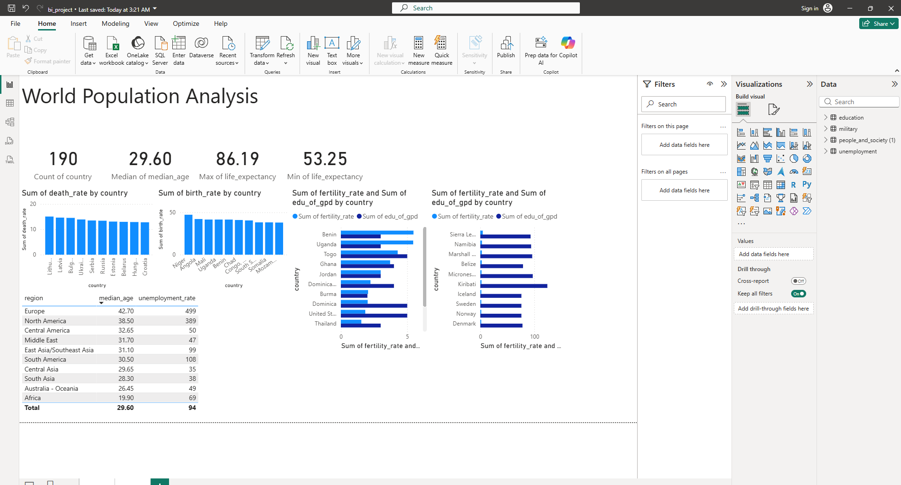
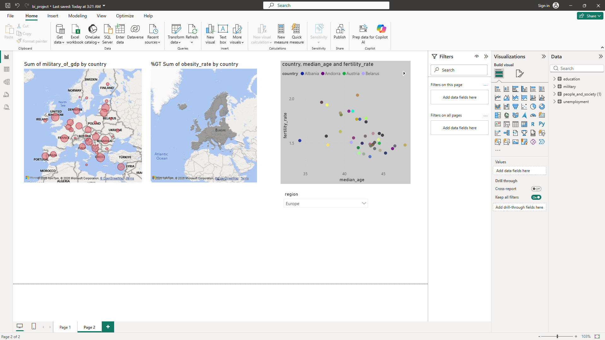

# World Population Analysis Dashboard

## Project Overview
This Power BI project analyzes global demographic and social indicators using interactive dashboards.

## Data Sources
- Education data
- Military expenditure data
- Population and society statistics
- Unemployment data

## Features
- Population analysis by region
- Fertility and median age comparison
- Military spending visualization
- Interactive filtering by region

## Tools Used
- Power BI
- CSV/TSV datasets
- Data visualization techniques

## Dashboard Screenshots

### Main Dashboard

### Regional Analysis

